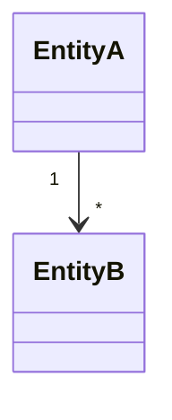
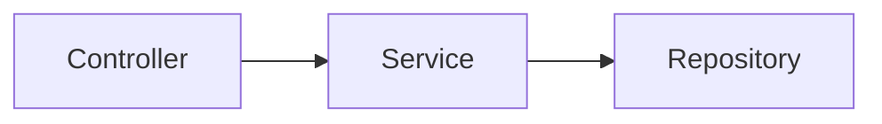

# CAUSW PR Writer

현재 체크아웃된 브랜치와 base 브랜치(기본값: `dev`) 사이의 변경사항을 git으로 분석하고,
프로젝트 PR 템플릿에 맞는 한국어 초안을 마크다운 파일로 생성한다.

## 실행 순서

### 1단계: 브랜치 및 변경사항 수집

아래 명령어를 순서대로 실행해 필요한 정보를 모은다.

```bash
# 현재 브랜치 확인
git branch --show-current

# 커밋 목록 (한 줄 요약)
git log <base>..<HEAD> --oneline

# 변경된 파일 목록과 통계
git diff <base>..<HEAD> --stat

# 실제 변경 내용 (너무 길면 --stat 기반으로만 분석해도 됨)
git diff <base>..<HEAD>

# 첫 커밋과 마지막 커밋 날짜 (개발기간 계산용)
git log <base>..<HEAD> --format="%ad" --date=short | tail -1
git log <base>..<HEAD> --format="%ad" --date=short | head -1
```

base 브랜치는 사용자가 지정하지 않으면 `dev`를 사용한다.

### 2단계: 정보 분석

수집한 데이터를 바탕으로 아래 항목을 파악한다.

- **관련 이슈/PR**: 커밋 메시지에서 `#숫자` 패턴 추출
- **변경 목적**: 커밋 메시지의 `feat:` / `fix:` / `refactor:` 등 prefix와 내용으로 파악
- **변경 범위**: 수정된 파일 경로로 어느 도메인/레이어가 영향받는지 파악
  - 예) `domain/community/comment` → 댓글 도메인, `shared/infra` → 인프라 공통
- **구조 변화**: 엔티티 연관관계, Controller→Service→Repository 흐름, 마이그레이션 데이터 흐름처럼 리뷰어가 그림으로 이해하면 좋은 변화가 있는지 파악
- **진행사항**: 커밋 단위로 완료된 작업 목록 구성
- **개발기간**: 첫 커밋 날짜 ~ 마지막 커밋 날짜

### 3단계: PR 초안 작성

아래 템플릿을 채워서 마크다운 파일로 저장한다.

**파일명**: `.claude/out-docs/pr-draft-<브랜치명>.md`

디렉터리가 없으면 먼저 생성한다:
```bash
mkdir -p .claude/out-docs
```

---

````markdown
### 🚩 관련사항
<!-- 관련 이슈/PR 번호. 없으면 "없음" -->

### 📢 전달사항
<!-- 변경 목적, 수정 내용, 집중해서 봐야 할 부분을 구체적으로 작성 -->

<!-- 구조 변화가 큰 PR이면 Mermaid 다이어그램 추가:
#### 구조 다이어그램




-->

### 📸 스크린샷
N/A

### 📃 진행사항
- [x] 항목1
- [x] 항목2

### ⚙️ 기타사항

개발기간: YYYY-MM-DD ~ YYYY-MM-DD
````

---

## 각 섹션 작성 가이드

**관련사항**
- 커밋 메시지에 `#123` 형태가 있으면 그대로 기입
- 없으면 "없음" 으로 기입

**전달사항**
- 단순 파일 나열이 아니라, "왜 바꿨는지 + 무엇을 바꿨는지 + 어디를 집중해서 봐야 하는지" 흐름으로 작성
- 레이어 변경(Service → Reader/Writer 분리 등), 연관관계 수정, 성능 개선 등 배경이 있으면 포함
- 길어도 괜찮다. 리뷰어가 컨텍스트를 파악할 수 있어야 한다.
- 구조 변화가 큰 PR은 `#### 구조 다이어그램` 하위에 Mermaid를 추가한다.
  - 엔티티/테이블 관계 변경이 있으면 `classDiagram`을 우선 사용한다.
  - API 호환 레이어, 서비스 위임, 데이터 이관처럼 흐름이 중요하면 `flowchart` 또는 `sequenceDiagram`을 추가한다.
  - 다이어그램은 실제 코드의 클래스명, 테이블명, 필드명을 사용하고 추정 관계를 넣지 않는다.
  - 단순 CRUD나 문구 수정처럼 그림이 리뷰 이해도를 높이지 않으면 생략한다.

**진행사항**
- 커밋 메시지를 기반으로 완료된 작업을 체크박스 목록으로 정리
- 커밋 prefix 기준:
  - `feat:` → 기능 구현
  - `fix:` → 버그 수정
  - `refactor:` → 리팩토링
  - `test:` → 테스트 추가/수정
  - `chore:` / `build:` → 설정 변경
- 미완성이거나 후속 작업이 필요한 항목은 `- [ ]` 로 표시

**개발기간**
- `git log` 날짜 기준으로 `YYYY-MM-DD ~ YYYY-MM-DD` 형식으로 기입

## 완료 후

파일 경로를 사용자에게 알려주고, 내용을 간략히 요약해서 보여준다.
내용이 불만족스러우면 피드백을 받아 수정한다.
